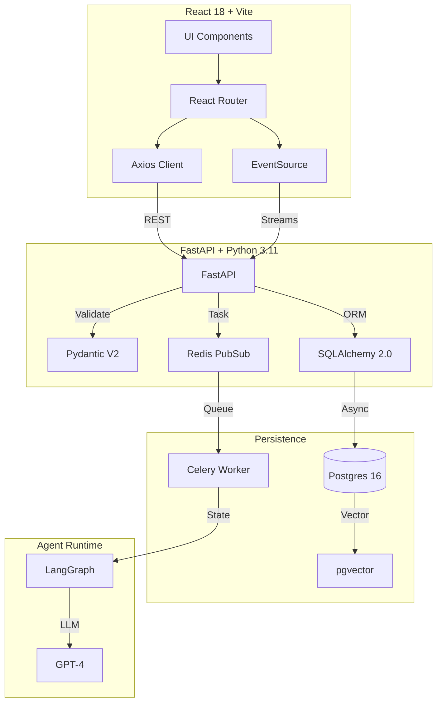

# Master Consolidations & Dependency Graph

## 1. Full Stack Compatibility
-   **Protocol**: HTTP/1.1 (REST) + HTTP/2 (SSE).
-   **Auth**: Bearer Token (JWT HS256).
-   **Content-Type**: `application/json`.

## 2. Dependency Graph

## 3. Deployment constraints
-   **Docker**: All services share a `bridge` network.
-   **Volume**: Postgres data must be persisted to `postgres_data` volume.
-   **Secrets**: Must use Docker Secrets or ENV injection in Prod (Not .env files).
