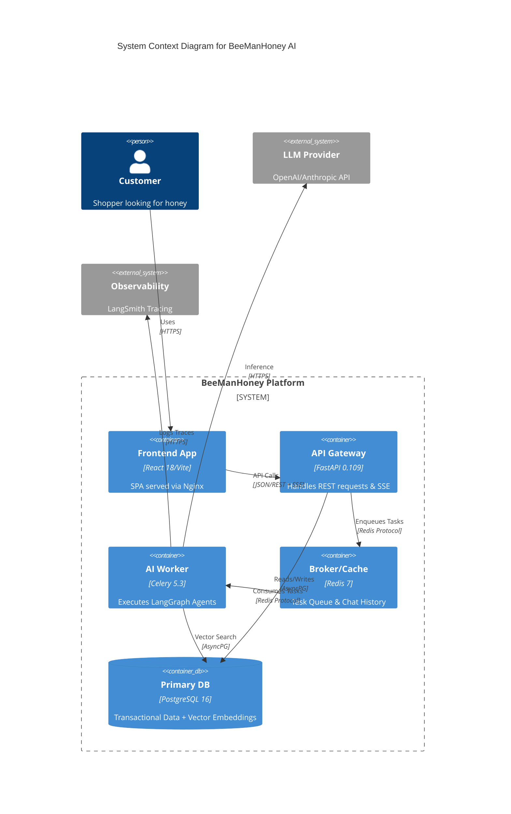

# System Architecture

## 1. Container Architecture Diagram

## 2. Component Detail

### 2.1. API Gateway (FastAPI)
-   **Responsibility**:
    -   **Routing**: API versioning (`/api/v1`).
    -   **Validation**: Pydantic V2 models for strict request/response schemas.
    -   **Streaming**: Server-Sent Events (SSE) endpoint for real-time AI responses.
-   **Scalability**: Stateless. Can be scaled horizontally behind Nginx/Traefik.

### 2.2. Async Worker (Celery + LangGraph)
-   **Responsibility**:
    -   **Agent Runtime**: Hosts the StateGraph (Supervisor -> Workers).
    -   **Long-running Tasks**: Bulk Product Import, Email sending.
-   **Concurrency**: Prefork execution pool. Each worker process handles one agent state transition at a time.
-   **State Management**: Transient state in Redis, Durable state (Orders) in Postgres.

### 2.3. Data Persistence Layer
-   **PostgreSQL**:
    -   **Schema**: Relational (Orders, Users) + Vector (Product Embeddings).
    -   **Extension**: `pgvector` v0.5.1 for HNSW indexing of `text-embedding-3-small` vectors (1536 dims).
-   **Redis**:
    -   **Broker**: Celery task queue default.
    -   **Cache**: Semantic Cache (store query-embedding pairs) to save OpenAI credits.

## 3. Technology Stack & Versions
| Component | Technology | Version | Rationale |
| :--- | :--- | :--- | :--- |
| **Frontend** | React | 18.2.0 | Standard, robust ecosystem. |
| **Bundler** | Vite | 5.1.0 | Fast HMR, optimized builds. |
| **Backend** | Python | 3.11 | Significant speedup over 3.10. |
| **Framework** | FastAPI | 0.109+ | Native AsyncIO, Auto OpenAPI. |
| **Orchestrator** | LangGraph | 0.0.22+ | Cyclic graph support for multi-turn agents. |
| **DB** | PostgreSQL | 16 | Performance, reliability. |
| **Vector** | pgvector | 0.5.1 | Integration with Postgres. |
| **Queue** | Redis | 7-alpine | Industry standard broker. |

## 4. Communication Protocols
-   **Frontend <-> API**: REST (JSON) only.
-   **Frontend <-> AI**: Server-Sent Events (SSE). No Polling.
-   **API <-> Worker**: Redis Pub/Sub for real-time updates.
-   **Worker <-> LLM**: HTTPS (Requests/Aiohttp).
